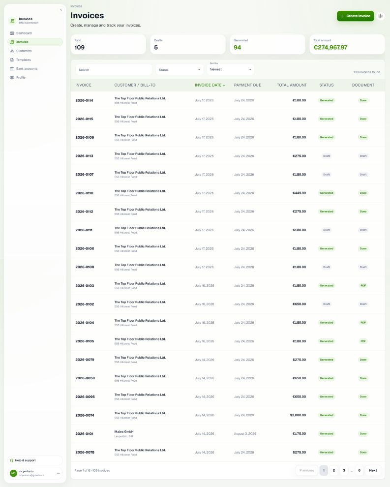
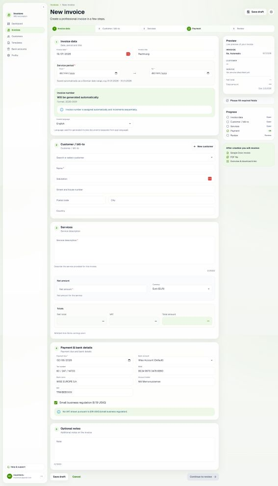
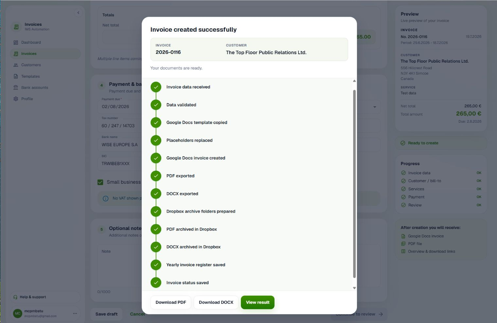
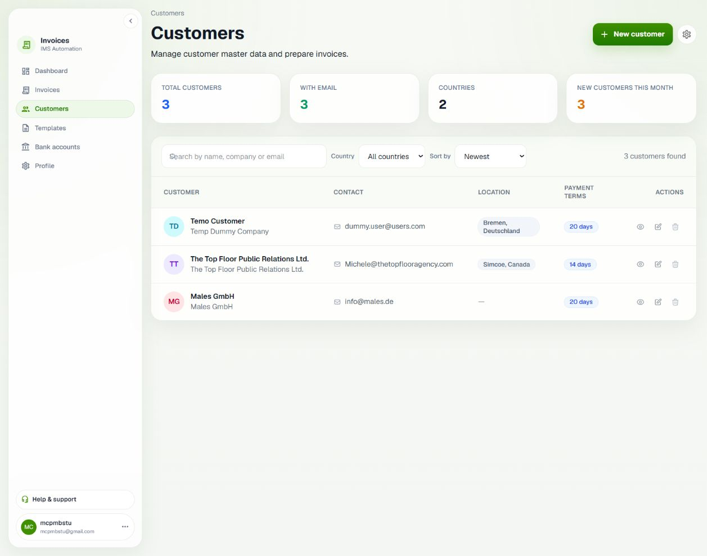
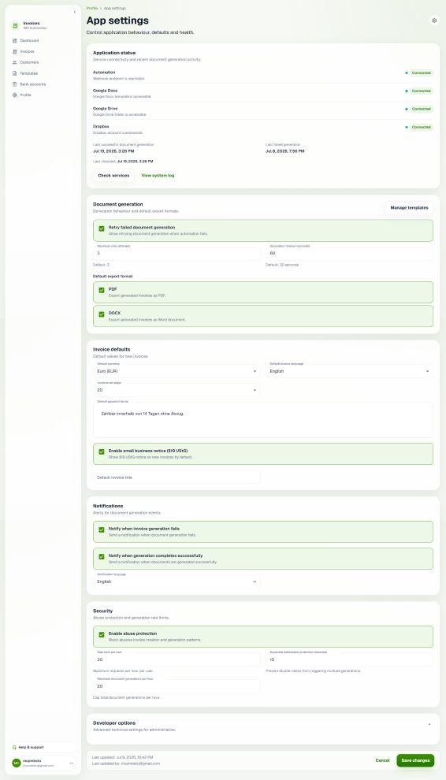
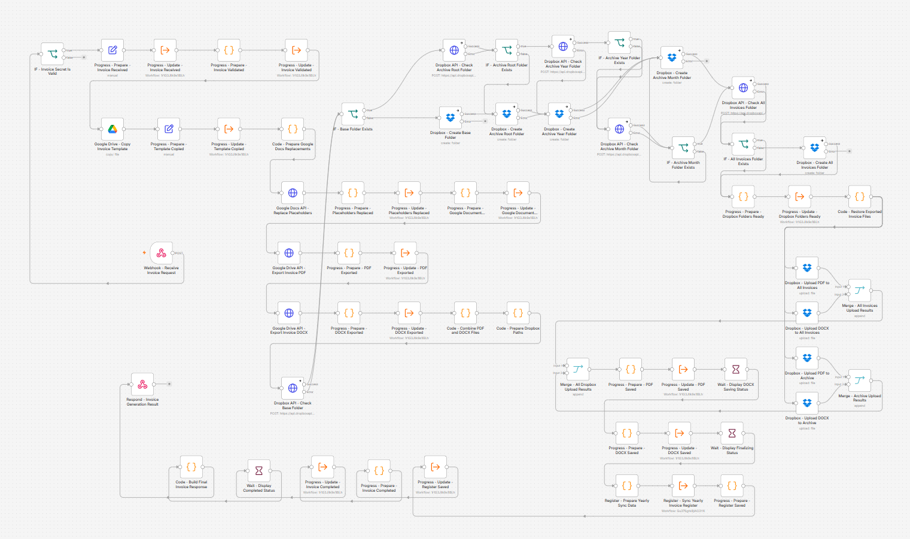

# IMS Invoice Automation

> Professional multilingual invoice management SaaS built with Next.js, Supabase, n8n, Google Docs, Google Drive, and Material UI.

## ✨ Features

- 📄 Professional invoice management
- 🌍 English & German interface
- 👥 Customer management
- ☁️ Google Docs invoice generation
- 📑 Automatic PDF generation
- 📁 Google Drive integration
- ⚡ n8n workflow automation
- 💳 Multiple bank accounts
- 🏢 German invoice support (§19 UStG)
- 📊 Invoice administration dashboard
- 🎨 Modern Material UI design system
- 📱 Responsive desktop/mobile interface

---

## 🛠 Tech Stack

- Next.js (App Router)
- TypeScript
- Material UI
- Supabase
- PostgreSQL
- n8n
- Google Docs API
- Google Drive API

---

## 📸 Application Screenshots

### Invoice management



*Browse, search, and manage invoices in a clean desktop SaaS table with status, amounts, and row actions.*

### Create invoice



*Structured invoice form with customer, service period, line items, VAT options, and bank account selection.*

### Live generation progress



*Step-by-step generation timeline while n8n creates Google Docs, PDF/DOCX, Dropbox archives, and the yearly register.*

### Customer directory



*Searchable customer list for bill-to contacts used across invoice creation and administration.*

### Automation health



*App settings health checks for Supabase, n8n, Dropbox, and related services with a persisted system log.*

## n8n Automation Workflow

The workflow validates invoice data, generates PDF and DOCX documents from a Google Docs template, creates the required Dropbox folders, uploads the files, synchronizes the yearly invoice register, and reports the generation status back to the application.

[](docs/screenshots/n8n-workflow-overview.png)

> Click the image to view the complete workflow in full resolution.

---

## 🚀 Local Development

```bash
git clone https://github.com/mamunzaman/ims-invoice-automation.git

cd ims-invoice-automation

npm install

npm run dev
```

---

## 🔐 Environment Variables

Create a `.env.local` file using `.env.example`.

Server-only (never `NEXT_PUBLIC_*`):

- `DROPBOX_ACCESS_TOKEN` — required for secure PDF/DOCX downloads via `/api/invoices/[id]/download/pdf|docx`
  - Local: set in `.env.local`, then restart `npm run dev`
  - Production: set in your hosting dashboard, then redeploy

---

## 📌 Status

Current Version

**v0.1.0**

Current Features

- Invoice Management
- Customer Management
- Google Docs Automation
- PDF Generation
- Google Drive Integration
- Multilingual UI
- Invoice Administration

Planned

- Email Sending
- Recurring Invoices
- Payment Tracking
- Analytics Dashboard
- Company Branding
- Live Invoice Generation Timeline

---

## 📄 License

MIT